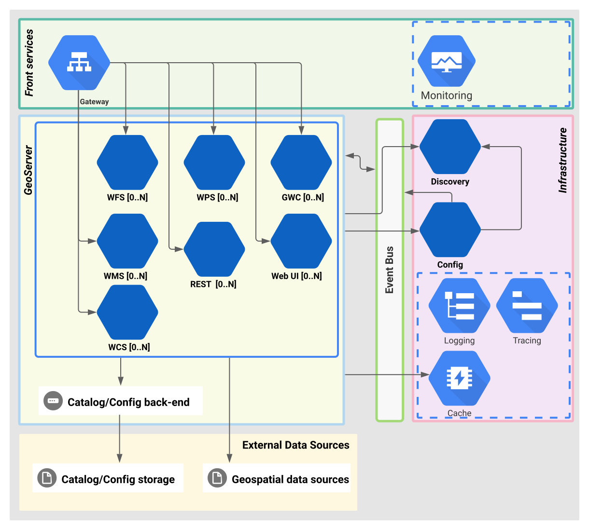

[](https://sonarcloud.io/summary/new_code?id=geoserver_geoserver-cloud)

[](https://sonarcloud.io/summary/new_code?id=geoserver_geoserver-cloud)
[](https://sonarcloud.io/summary/new_code?id=geoserver_geoserver-cloud)
[](https://sonarcloud.io/summary/new_code?id=geoserver_geoserver-cloud)
[](https://sonarcloud.io/summary/new_code?id=geoserver_geoserver-cloud)
[](https://sonarcloud.io/summary/new_code?id=geoserver_geoserver-cloud)
[](https://sonarcloud.io/summary/new_code?id=geoserver_geoserver-cloud)
[](https://sonarcloud.io/summary/new_code?id=geoserver_geoserver-cloud)

[](https://sonarcloud.io/summary/new_code?id=geoserver_geoserver-cloud)
[](https://sonarcloud.io/summary/new_code?id=geoserver_geoserver-cloud)
[](https://sonarcloud.io/summary/new_code?id=geoserver_geoserver-cloud)
[](https://github.com/geoserver/geoserver-cloud/actions/workflows/build-and-push.yaml)

# GeoServer Cloud

[GeoServer](https://geoserver.org/) is an open-source server for sharing and editing geospatial data from any major spatial data source using open standards.

**GeoServer Cloud** builds on GeoServer to provide a [Cloud Native](https://en.wikipedia.org/wiki/Cloud-native_computing) distribution of its geospatial services and APIs.

## Architecture

The following diagram shows the system’s general architecture.



*GeoServer Cloud* is designed to achieve [functional decomposition by business capability](https://microservices.io/patterns/decomposition/decompose-by-business-capability.html), adapting and extending *GeoServer* components to promote higher cohesion and lower coupling.

Each OWS service, the Web UI, and the REST API are restructured as self-contained, individually deployable, and scalable microservices.

## Technology

Since *GeoServer* is a traditional [Spring Framework](https://spring.io/) monolithic servlet application, *GeoServer Cloud* leverages [Spring Boot](https://spring.io/projects/spring-boot) for microservice conversion.

Additionally, *GeoServer Cloud* uses [Spring Cloud](https://spring.io/projects/spring-cloud) to provide essential capabilities for building scalable and resilient distributed systems, such as:

* **Service Communication and Discovery**: Ensuring that services can dynamically find and communicate with each other without hard-coded addresses, which is key for a distributed system that may scale or change frequently.
* **Configuration Management**: Allowing centralized or externalized configuration, so each service can be configured independently, which is important for flexibility and ease of management.
* **Event Coordination**: Handling distributed events so that services can react to changes or triggers in real-time, enhancing the system’s responsiveness and resilience.
* **API Management**: Providing a single entry point through an API gateway, which simplifies client interactions, enhances security, and enables load balancing for improved scalability.

*GeoServer Cloud* integrates [GeoServer ACL](https://github.com/geoserver/geoserver-acl), and advanced authorization system based on Access Control Lists.

### Supported Extensions

Only a curated selection of the extensive [GeoServer extensions](http://geoserver.org/release/stable) is supported, ensuring compatibility and optimized performance in this cloud-native environment. The current supported extensions include:

* **Catalog and Configuration**:
    * PGConfig
    * JDBC `jdbcconfig` and `jdbcstore` (deprecated)
* **Security**:
    * GeoServer ACL
    * JDBC Security
    * LDAP Security
    * Key Authentication
    * GeoNode Authentication
* **Cartography**:
    * CSS Styling
    * MBStyle Styling
* **Input Sources**:
    * GeoPackage
    * GeoParquet
    * Cloud Optimized GeoTIFF
    * PMTiles with vector tiles
    * Pre-generalized Features
    * ImagePyramid
* **Output Formats**:
    * WFS FlatGeobuf
    * WFS DXF
    * WMS VectorTiles
* **Tiling Extensions**:
    * S3 Tile Storage
    * Azure Blob Storage
    * Google Cloud Storage Blob Storage
* **Miscellaneous**:
    * [Control flow](https://docs.geoserver.org/main/en/user/extensions/controlflow/index.html)
    * Importer
    * Resource Browser Tool
    * International Astronomical Union CRS authority

## License

*GeoServer Cloud* licensed under the [GPLv2](LICENSE.txt).

## Distribution and deployment

* Docker images for all the services are available on DockerHub, under the [GeoServer Cloud organization](https://hub.docker.com/u/geoservercloud/).

* A base Helm Chart for Kubernetes is available at the [camptocamp/helm-geoserver-cloud](https://github.com/camptocamp/helm-geoserver-cloud) Github repository.

### First contact:

If you're looking for instructions to just get *GeoServer Cloud* up and running for a quick evaluation, consider the following documentation sources:

* The [Quick Start guide](https://geoserver.org/geoserver-cloud/#quick-start) provides instructions on how to get up and running with `docker compose`.

* The Helm Chart repository provides [examples](https://github.com/camptocamp/helm-geoserver-cloud/tree/master/examples) of how to start deploying on Kubernetes.

## Status

`v2.28.1.3` released on top of GeoServer `2.28.1`.

Check out the full [Release Notes](https://github.com/geoserver/geoserver-cloud/releases) for a changelog.

## Contributing

Please read [the contribution guidelines](CONTRIBUTING.md) before contributing pull requests to the GeoServer Cloud project.

Follow the [developer's guide](docs/develop/index.md) to know more about the project's technical details.

## Bugs

*GeoServer Cloud* uses [GitHub issues](https://github.com/geoserver/geoserver-cloud/issues) to track
project-specific bugs and feature requests.

The upstream *GeoServer* project uses [JIRA](https://osgeo-org.atlassian.net/projects/GEOS) for issue tracking.

If you encounter a bug, please check if it's reported as a GeoServer bug in JIRA first.

## Building

Requirements:

 * Java 25 JDK
 * Maven 3.9.11+ (included with the `mvnw` maven wrapper)
 * A recent [Docker](https://docs.docker.com/engine/install/) version with the [Compose](https://docs.docker.com/compose/) plugin.
 * [GNU Make](https://www.gnu.org/software/make/) (optional, recommended).


This is a super quick-start guide to make your first build. For more detailed information on the build process and options, follow the [Build Instructions](./docs/develop/build_instructions.md) guide.

Clone the repository, including submodules. Alternatively, replace the repository URL by your own fork's:

```shell
git clone --recurse-submodules git@github.com:geoserver/geoserver-cloud.git
```
Build with:

```shell
cd geoserver-cloud/
make
```

The `make` command will compile, test, and install all the project artifacts. It will also build the GeoServer-Cloud Docker images for your local platform. The CI/CD build will instead build milti-platform images for `linux/amd64` and `linux/arm64` architectures, and publish them to the `docker.io` Docker registry.

#### Running the build

The `compose/` folder contains several docker compose files that are **exclusively** for development purposes. If you want to run a *GeoServer Cloud* Docker composition for
development and testing, `cd compose` and run one of the following scripts. Each of them starts the composition with a different GeoServer Catalog back-end:

* `./pgconfig up -d`: runs *GeoServer Cloud* with the new and shiny PostgreSQL catalog back-end
* `./datadir up -d`: runs *GeoServer Cloud* with a bind-mounted shared data directory
* `./jdbcconfig up -d`: runs *GeoServer Cloud* with the older and deprecated `jdbcconfig` catalog back-end

Verify the services are running:

```
$ curl "http://localhost:9090/geoserver/cloud/ows?request=getcapabilities&service={WMS,WFS,WCS,WPS}"
$ curl -u admin:geoserver "http://localhost:9090/geoserver/cloud/rest/workspaces.json"
```

Browse to [http://localhost:9090/geoserver/cloud/](http://localhost:9090/geoserver/cloud/)


