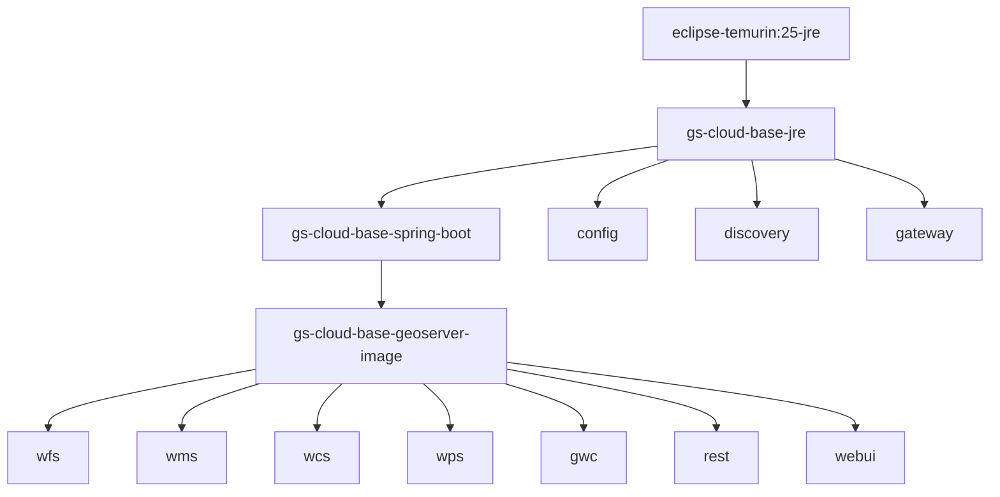

# Docker Images

This document explains the Docker image architecture in GeoServer Cloud, including the base image hierarchy and layer sharing strategy that optimizes disk usage and build times.

## Base Image Hierarchy

GeoServer Cloud uses a layered base image strategy to maximize layer sharing across all microservices:



### Base Images

| Image | Based On | Adds |
|-------|----------|------|
| `gs-cloud-base-jre` | `eclipse-temurin:25-jre` | JVM options (`--add-opens`, heap settings), system CA certificates |
| `gs-cloud-base-spring-boot` | `gs-cloud-base-jre` | Spring Boot layered JAR structure, curl for health checks, default config |
| `gs-cloud-base-geoserver-image` | `gs-cloud-base-spring-boot` | Fonts (DejaVu, Noto, Roboto, etc.), GeoServer common dependencies, DuckDB extensions |

### Service Images

All GeoServer OWS services (WFS, WMS, WCS, WPS, GWC, REST, WebUI) extend `gs-cloud-base-geoserver-image`, adding only their service-specific application code.

Infrastructure services (Config, Discovery, Gateway) extend `gs-cloud-base-spring-boot` directly since they don't need GeoServer dependencies.

## Layer Sharing

The layered architecture ensures that all GeoServer microservices share ~908MB of common layers. Each service adds only 2-22MB of unique application code.

**Example: GeoServer services layer analysis**

| Image | Display Size | Shared  | Unique |
|-------|-------------|---------|--------|
| wcs   | 909MB       | 907.8MB | 1.7MB  |
| wps   | 910MB       | 907.8MB | 2.3MB  |
| wfs   | 916MB       | 907.8MB | 8.2MB  |
| rest  | 918MB       | 907.8MB | 10.4MB |
| wms   | 923MB       | 907.8MB | 14.8MB |
| gwc   | 922MB       | 907.8MB | 14.2MB |
| webui | 929MB       | 907.8MB | 21.5MB |

**Actual disk usage for all 7 GeoServer services:**

```
907.8MB (shared once) + 73MB (sum of unique) = ~981MB
```

Instead of 7 × 920MB = 6.4GB apparent.

This means deploying all 7 GeoServer services uses less than 1GB of actual disk space, not 6.4GB as the individual image sizes might suggest.

## Analyzing Layer Sharing

### Check Actual Disk Usage

Use `docker system df -v` to see actual disk consumption with shared vs unique sizes:

```bash
docker system df -v | grep -A 50 "REPOSITORY"
```

Example output:

```
REPOSITORY                                     TAG              IMAGE ID       SIZE      SHARED SIZE   UNIQUE SIZE
geoservercloud/geoserver-cloud-wfs             3.0.0-SNAPSHOT   12cee949a17d   916MB     907.8MB       8.163MB
geoservercloud/geoserver-cloud-wms             3.0.0-SNAPSHOT   919b96914846   923MB     907.8MB       14.78MB
...
```

### Compare Layers Across Images

To see which layers are shared across images:

```bash
for img in geoservercloud/geoserver-cloud-{wms,wfs,wcs,wps,gwc,webui,rest}:3.0.0-SNAPSHOT; do
  echo "=== $img ==="
  docker inspect "$img" --format='{{range .RootFS.Layers}}{{.}}{{"\n"}}{{end}}'
done | sort | uniq -c | sort -rn
```

Layers appearing 7 times are shared across all services (the base image layers). Layers appearing once are unique to each service.

### Count Total vs Unique Layers

```bash
# Dump all layers
for img in $(docker images --format '{{.Repository}}:{{.Tag}}' | grep 3.0.0-SNAPSHOT); do
  docker inspect "$img" --format='{{range .RootFS.Layers}}{{.}}{{"\n"}}{{end}}'
done > /tmp/all-layers.txt

# Count
echo "Total layer references: $(wc -l < /tmp/all-layers.txt)"
echo "Unique layers: $(sort -u /tmp/all-layers.txt | wc -l)"
```

## Best Practices

1. **Always build base images first** - The Makefile enforces this with dependencies
2. **Don't skip base image rebuilds** - When dependencies change, rebuild from `gs-cloud-base-geoserver-image` down
3. **Use `make build-image-geoserver <service>`** - During development, rebuild only the service you're working on
4. **Check layer sharing periodically** - Ensure changes don't accidentally break layer sharing
