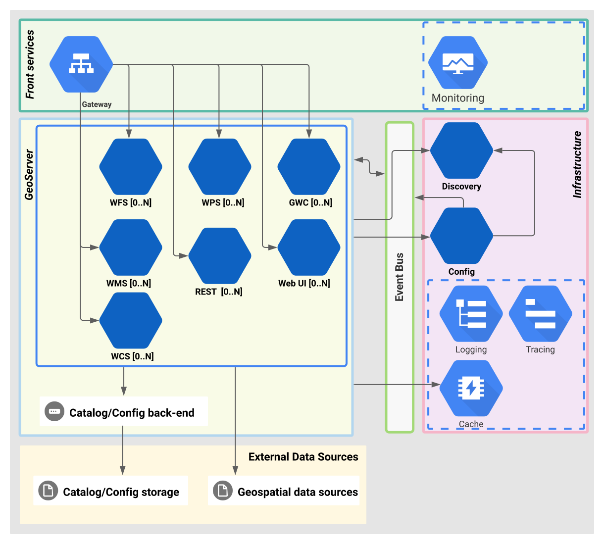

# Developer Guide

# Technology Overview

GeoServer Cloud microservices use the Spring Boot framework.

Spring Cloud technologies enable dynamic service discovery, externalized configuration, distributed events, and API gateway functionality.

We support a curated list of GeoServer extensions verified for this architecture.

# System Architecture

The following diagram depicts the system architecture:



Each microservice is self-contained and includes only the necessary GeoServer dependencies.

## Components Overview

* Front services:
    * Gateway
    * Monitoring
* Infrastructure:
    * Consul (Service Registry)
    * Config
    * Event bus
    * Logging
    * Tracing
    * Cache
* GeoServer:
     * Catalog
     * OWS services
     * REST API service
     * Web-UI service
     * GWC service

# Project Source Code Structure

```
        src/ ......................................... Project source code root directory
        |_ apps ...................................... Root directory for microservice applications
        |    |_ base-images/ ......................... Base Docker images for containerization
        |    |     |_ geoserver/ ..................... Base image for GeoServer services
        |    |     |_ jre/ ........................... Base JRE image
        |    |     |_ spring-boot/ ................... Base Spring Boot image
        |    |
        |    |_ infrastructure/ ...................... Infrastructure services
        |    |     |_ config/ ........................ Spring-cloud config service
        |    |     |_ gateway/ ....................... Spring-cloud gateway service
        |    |
        |    |_ geoserver/ ........................... Root directory for geoserver based microservices
        |          |_ gwc/ ........................... GeoWebcache Service
        |          |_ restconfig/ .................... GeoServer REST config API Service
        |          |_ wcs/ ........................... Web Coverage Service
        |          |_ webui/ ......................... GeoServer administration Web User Interface
        |          |_ wfs/ ........................... Web Feature Service
        |          |_ wms/ ........................... Web Map Service
        |          |_ wps/ ........................... Web Processing Service
```

# Docker Images

Refer to the [Docker image architecture](docker-images.md) for details on hierarchy and layer sharing.

# Logging

Refer to [logging configuration](logging.md) for details on redirection and integration.

# Running for Development and Testing

The `./compose` folder contains Docker Compose files for development.

### Run as Non-Root

Set the `GS_USER` variable in the `.env` file to your user and group IDs.

### Choose Your Catalog Backend

#### DataDirectory Catalog Backend

The `datadir` profile enables the traditional data directory backend.

Run with:

```bash
$ ./datadir up -d
```

#### PostgreSQL Catalog Backend

The `pgconfig` profile enables the PostgreSQL catalog backend. 
This requires a PostgreSQL 15.0+ database.

Run with:

```bash
$ ./pgconfig up -d
```

### Access GeoServer

Verify services are running:

```bash
$ docker compose ps
```

Access via the gateway at [http://localhost:9090/geoserver/cloud/](http://localhost:9090/geoserver/cloud/).

---

# Running for Development

## Docker Compose

Start the services:

```bash
$ docker compose up -d
```

Watch logs:

```bash
$ docker compose logs -f
```

Example status:

```bash
gscloud_config_1      Up (healthy)
gscloud_database_1    Up (healthy)
gscloud_consul_1      Up (healthy)
gscloud_gateway_1     Up (healthy)
...
```

## Running a Service in Local Mode

Run essential infrastructure services:

```bash
$ docker compose up -d consul rabbitmq config database gateway
```

Run a specific service from the command line:

```bash
$ ./mvnw -f services/wfs spring-boot:run -Dspring-boot.run.profiles=local
```

Default local ports:
* `wfs-service`: 9101
* `wms-service`: 9102
* `wcs-service`: 9103
* `wps-service`: 9104
* `restconfig-v1`: 9105
* `web-ui`: 9106

At startup, the service contacts Consul at `http://localhost:8500`. 
This is configured in the `local` Spring profile. 
Consul provides the locations of other services, including the config service.
