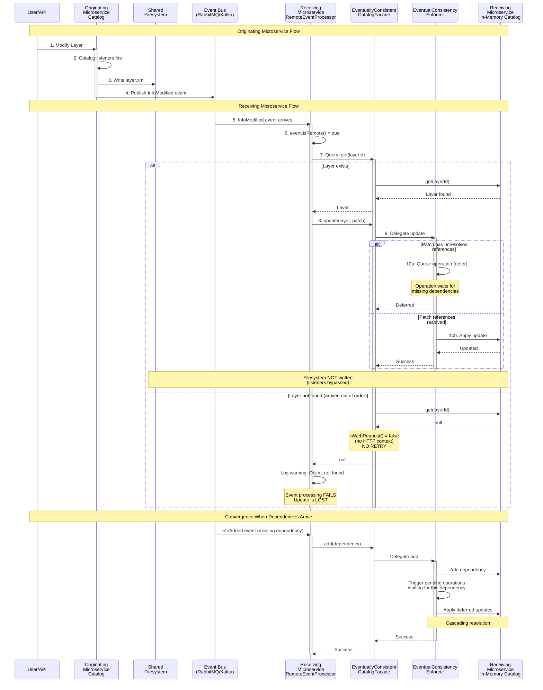

# GeoServer Cloud Data Directory Catalog Backend

The **gs-cloud-catalog-backend-datadir** module provides a catalog and configuration backend for GeoServer Cloud that uses the traditional file-system based data directory format. This allows GeoServer Cloud deployments to leverage existing data directories while adding distributed system capabilities.

## Overview

This backend enables distributed GeoServer Cloud nodes to share a common data directory while handling the challenges of eventual consistency in a distributed environment where catalog modification events may arrive out of order across nodes.

## Features

- Compatible with existing GeoServer data directories (traditional XML format)
- Catalog changes propagate across all nodes via distributed events
- Handles out-of-order event delivery gracefully
- Automatic query retries during catalog convergence periods
- Fast startup with parallel loading, even for large catalogs
- Tunable retry intervals and behavior

## Architecture

### Core Components

#### EventualConsistencyEnforcer

Manages deferred catalog operations when distributed events arrive out of order. Tracks pending operations that have unresolved dependencies, queues them, and automatically retries when dependencies arrive. Implements cascading resolution to handle dependency chains (Store → Resource → Layer).

#### EventuallyConsistentCatalogFacade

Wraps the catalog facade to provide resilience during convergence periods. Delegates all mutations to `EventualConsistencyEnforcer` and implements retry logic for query operations. Only retries web requests when the catalog hasn't converged, never retries internal operations to avoid blocking startup.

#### RemoteEventDataDirectoryProcessor

Synchronizes the local catalog with remote events. Listens for distributed events (`InfoAdded`, `InfoModified`, `InfoRemoved`) and applies changes from event payloads directly to the `CatalogFacade`, bypassing catalog listeners to avoid redundant filesystem writes.

#### DataDirectoryBackendConfiguration

Spring configuration that assembles the data directory backend components. Creates and wires the catalog facade (optionally wrapped with eventual consistency), GeoServer loader, resource store, and configuration lock. Configures retry intervals from properties and determines whether to enable eventual consistency enforcement based on configuration.

## Configuration

### Properties

```yaml
geoserver:
  backend:
    data-directory:
      # Enable the data directory backend
      enabled: true

      # File system path to the data directory
      location: /path/to/datadir

      # Use parallel loading for faster startup
      parallel-loader: true

      # Eventual consistency configuration
      eventual-consistency:
        # Enable eventual consistency enforcement (recommended for distributed deployments)
        enabled: true

        # Retry intervals in milliseconds for catalog query operations
        # [25, 25, 50] means: wait 25ms, retry; wait 25ms, retry; wait 50ms, retry
        # Total maximum wait time: 100ms over 3 attempts
        retries: [25, 25, 50]
```

### Default Values

- `enabled`: `false`
- `parallel-loader`: `true`
- `eventual-consistency.enabled`: `true` (recommended for all distributed deployments)
- `eventual-consistency.retries`: `[25, 25, 50]`

### Activation Requirements

The backend activates when:
1. `geoserver.backend.data-directory.enabled=true`
2. Distributed event bus is configured (RabbitMQ, Kafka, etc.)

## Usage

### Standard Deployment (Recommended)

GeoServer Cloud runs as multiple microservices (rest-api, wms-service, wfs-service, etc.), each modifying and reading the shared catalog. Eventual consistency **must** be enabled:

```yaml
geoserver:
  backend:
    data-directory:
      enabled: true
      location: /shared/datadir  # Mounted on all microservices
      eventual-consistency:
        enabled: true
        retries: [25, 25, 50]
```

Requirements:
- Shared data directory mounted on all microservices (NFS, Kubernetes ReadWriteMany persistent volume, etc.)
- Distributed event bus configured (RabbitMQ, Kafka)
- All microservices receive catalog events from each other

### Static Catalog (Special Case)

Eventual consistency can **only** be disabled if the catalog is static and will never be modified after application startup:

```yaml
geoserver:
  backend:
    data-directory:
      enabled: true
      location: /var/geoserver/datadir
      eventual-consistency:
        enabled: false  # Only for read-only catalogs
```

This configuration is rare and only suitable for deployments where:
- No catalog modifications will occur through REST API or UI
- Catalog is loaded once at startup and never changes
- All catalog configuration is managed externally (e.g., CI/CD updates require restart)

## The Eventual Consistency Mechanism

### Why Eventual Consistency is Required

GeoServer Cloud uses distributed events as the canonical mechanism for synchronizing catalog changes across microservices. This creates two fundamental challenges that require eventual consistency:

#### 1. Event-Driven Architecture and Filesystem Impedance Mismatch

All microservices share a common data directory, but changes are synchronized via events, not filesystem reads:

**On the originating microservice** (where a change is made):
```
User/API → Catalog operation → Listeners fire → Filesystem WRITTEN → Event published
```

**On receiving microservices** (where remote event arrives):
```
Event received → CatalogFacade operation DIRECTLY → In-memory catalog updated
                                                   → Filesystem NOT WRITTEN (listeners bypassed)
```

This design is intentional: receiving microservices apply changes from event payloads directly to their in-memory catalog and bypass catalog listeners (including the `GeoServerConfigPersister` that writes to filesystem). Only the originating microservice persists the change to the shared filesystem.

**The impedance mismatch:**

Since the shared filesystem is written by originating microservices but not by receiving ones, there's no coordination between:
- When filesystem writes complete and propagate across shared storage
- When events are sent and received
- The order in which either happens

This means the filesystem state can be:
- **Ahead of events**: File already updated by originating microservice, but event still in transit
- **Behind events**: Event arrived, but filesystem write hasn't propagated through shared storage yet
- **Inconsistent with events**: Multiple changes in flight with no ordering guarantees

Therefore, **changes must be applied from event payloads**, not by reading from the filesystem. The filesystem serves only as:
- Persistence layer on originating microservices
- Bootstrap/cold-start mechanism (read only at application startup, then ignored during runtime)

#### 2. Out-of-Order Event Delivery

Network conditions mean events may arrive at each microservice in different orders:
- Objects have dependencies: Layer → Resource → Store → Workspace
- If a Layer event arrives before its Resource event, attempting to add the Layer with unresolved references would fail or corrupt the catalog

### Event Processing Flow

The following diagram illustrates how remote events are processed by the data directory backend:



The diagram shows:

- Originating microservice writes to filesystem and publishes events
- Receiving microservices apply changes from event payloads, bypass filesystem writes
- Mutation operations (add/update/remove) go through `EventualConsistencyEnforcer`:
  - Unresolved references → deferred (queued)
  - Resolved references → executed immediately
- Query operations during event processing do NOT retry:
  - `isWebRequest()` returns false (no HTTP context from RabbitMQ)
  - Object not found → returns immediately
  - **Modify/Remove events can fail if object doesn't exist yet**
- Convergence happens when dependencies arrive, triggering deferred operations

### Solution: Two-Phase Approach

#### 1. Mutation Deferral (EventualConsistencyEnforcer)

When events arrive out of order, operations with unresolved references are queued and automatically retried when dependencies arrive. For example, if a Layer event arrives before its Resource, the Layer add is deferred until the Resource event arrives, then cascading resolution completes both operations in the correct order.

#### 2. Query Retry (EventuallyConsistentCatalogFacade)

REST API and OWS requests that return null during convergence are retried with configurable intervals (default: 25ms, 25ms, 50ms). Retries only occur when:
- Request is from a web client (not internal)
- Catalog hasn't converged (pending operations exist)
- Each retry attempts to resolve pending operations

### Performance Characteristics

**Normal operation (converged catalog):**
- Query operations: ~microseconds
- Mutation operations: Direct execution, no deferral
- Zero retry overhead

**During convergence:**
- Query retry delay: Up to 100ms total (configurable)
- Typical convergence time: <100ms
- Network latency determines event propagation time

**With persistent dangling references:**
- Catalog never converges
- Each null-returning query wastes configured retry time
- Consider disabling eventual consistency if catalog has many dangling references

## Deployment Patterns

### When to Use This Backend

**Good fit:**
- Existing GeoServer installations migrating to GeoServer Cloud
- Deployments requiring file-system based configuration
- Multi-node deployments needing shared catalog state
- Scenarios where traditional XML configuration is preferred

**Not recommended:**
- Very large catalogs (>10,000 objects) - consider pgconfig backend
- High-frequency catalog updates - consider database backend
- Catalogs with many dangling references

### Production Considerations

File system requirements:
- Use reliable shared storage (NFS, Kubernetes ReadWriteMany persistent volume)
- Ensure proper locking support
- Monitor I/O performance

Event bus requirements:
- Configure message persistence
- Set appropriate TTLs
- Monitor queue depths

Monitoring:
- Track catalog convergence state
- Monitor pending operations count
- Alert on prolonged non-convergence

## Module Structure

```
src/catalog/backends/datadir/
├── src/main/java/org/geoserver/cloud/
│   ├── catalog/backend/datadir/
│   │   ├── EventualConsistencyEnforcer.java          # Core deferral logic
│   │   └── EventuallyConsistentCatalogFacade.java    # Query retry wrapper
│   ├── config/catalog/backend/datadirectory/
│   │   ├── DataDirectoryBackendConfiguration.java    # Spring configuration
│   │   ├── DataDirectoryProperties.java              # Configuration properties
│   │   └── CloudDataDirectoryGeoServerLoader.java    # Custom loader
│   ├── event/remote/datadir/
│   │   └── RemoteEventDataDirectoryProcessor.java    # Event synchronization
│   └── autoconfigure/catalog/backend/datadir/
│       ├── DataDirectoryAutoConfiguration.java
│       └── RemoteEventDataDirectoryAutoConfiguration.java
└── src/test/java/...
    └── EventualConsistencyEnforcerTest.java          # Comprehensive tests
```

## Testing

The module includes comprehensive test coverage:

Unit tests:
- `EventualConsistencyEnforcerTest` - Tests pending operation lifecycle, cascading resolution
- `EventuallyConsistentCatalogFacadeTest` - Tests query retry behavior

Integration tests:
- `RemoteEventDataDirectoryAutoConfigurationTest` - Tests auto-configuration
- `DataDirectoryUpdateSequenceTest` - Tests update sequence tracking

Run tests:
```bash
./mvnw test -pl src/catalog/backends/datadir
```

## Troubleshooting

### Catalog never converges

**Symptoms:** All queries retry unnecessarily, wasting ~100ms per request

**Cause:** Dangling references in the loaded catalog (layer groups pointing to deleted layers, etc.)

**Solution:** Either:
1. Clean up dangling references in the data directory
2. Disable eventual consistency for single-node or clean catalogs
3. Set `retries: []` to disable query retries (still defers mutations)

### Events not processed

**Symptoms:** Changes on one node don't appear on other nodes

**Checks:**
1. Verify event bus is configured and connected
2. Check `geoserver.catalog.events.enabled=true`
3. Look for errors in event processor logs
4. Verify nodes share the same data directory

### Slow startup

**Symptoms:** Application takes long to start

**Checks:**
1. Verify `parallel-loader: true` is set
2. Check data directory is on fast storage
3. Monitor pending operations during startup
4. Consider reducing catalog size or switching backends

## See Also

- [GeoServer Cloud Documentation](https://github.com/geoserver/geoserver-cloud)
- [Catalog Plugin Architecture](../../plugin/README.md)
- [PgConfig Backend](../pgconfig/README.md) - Alternative backend for large catalogs
- [Event System](../../events/README.md) - Distributed event infrastructure
