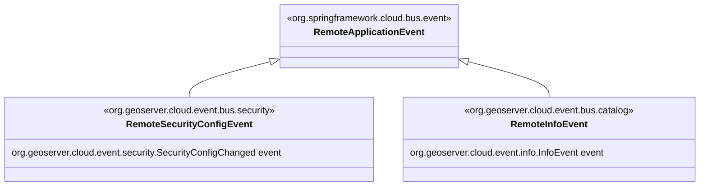

# GeoServer catalog integration for Spring-Cloud event-bus

Sets up the basis for an event-stream based synchronization of configuration changes across services in the cluster.

This module uses [spring-cloud-bus](https://cloud.spring.io/spring-cloud-static/spring-cloud-bus/3.0.0.M1/reference/html/) to notify all services in the cluster of catalog and geoserver configuration changes.

The remote event notification mechanism is agnostic of the transport layer, which depends on the configured [spring-cloud-streams](https://cloud.spring.io/spring-cloud-static/spring-cloud-stream/3.0.6.RELEASE/reference/html/)  Message Broker, which is in principle any supported [AMQP](https://www.amqp.org/) (Advanced Message Queuing Protocol) provider, Apache Kafka, Kafka Streams, Google PubSub, Azure Event Hubs, and more, depending on the `spring-cloud-streams` release and third-party binder implementations;

We're using [RabbitMQ](https://www.rabbitmq.com/) as the message broker in the default configuration, by means of including the `gs-cloud-catalog-event-bus-amqp` dependency in all services, which this particular module does not depend on.



## Configuration

Enabling event-bus propagation of `RemoteApplicationEvent`s depends on `spring-cloud-bus` auto-configuration through the externalized configuration property `spring.cloud.bus.enabled=true`. Additionally, the transport layer should be configured, like in the following example:

```yaml
spring:
  rabbitmq:
    host: localhost
    port: 5672
    username: guest
    password: guest
  cloud:
    bus.enabled: true
    stream:
      bindings:
        springCloudBusOutput:
          destination: gscatalog
        springCloudBusInput:
          destination: gscatalog
```

If such is the case, GeoServer remote events are automatically enabled (see `RemoteApplicationEventsAutoConfiguration`).

The remote events propagated by this module may or may not carry the changed object payload (`org.geoserver.catalog.Info` object) and the "diff" (`PropertyDiff` payload sent on modification events). By default, it is considered that the full object payload is not necessary, but only the object type and id are enough information in most cases (like for evicting local caches).

The following externalized configuration property flags can enable them:

```yaml
geoserver:
  bus:
    send-object: true
    send-diff: true
```

Whether they're needed depends on the geoserver backend type and configuration, as explained below.

## Usage

Upon catalog and config change events occurred in a given cluster node, a `RemoteApplicationEvent` is published to the bus,  and all service instances receive it.

It is not up to this module to decide what to do on the `RemoteApplicationEvent` receiving ends. The only listener auto-configured by this module takes care of evicting `Catalog`'s `ResourcePool` cached live data-access objects (such as `org.geotools.data.DataAccess`). See `RemoteEventResourcePoolProcessor`.

Instead, the actions to be taken upon receiving remote notification events will depend on the currently configured GeoServer backend. Typically, the `org.geoserver.cloud.config.catalog.GeoServerBackendConfigurer` implementation that's active due to auto-configuration, will register the listeners to the kind of events it needs, and act accordingly.

May the configuration backend type and topology require receiving either the full object, the diff changes (open "modify" events), or both; it's up to the `GeoServerBackendConfigurer` to complain if sending the required event payload is not enabled.

There're basically two major backend topologies, regardless of the actual implementation (e.g. "data directory", "jdbcconfig", "pgconfig", etc):

- shared catalog: The catalog/config stores are shared among all geoserver services, hence typically the event payload would not be required;
- catalog-per-service: each service instance holds on its own copy of the catalog and config objects, hence typically the remote configuration events should carry the object and/or diff payloads to keep the local version of the catalog and config in sync.

Note, however, the catalog-per-service approach would not be achievable in an elastically scalable deployment, where service instances of the same kind may scale out and down to satisfy demand, or for high availability, hence the preferred default configuration is the "shared catalog" with an appropriate, scalable, catalog backend.

## Technical details

### Local config events propagation

In order to favor loose coupling between components, the "event listener" approach to `Catalog` and `GeoServer` configuration is replaced by a Spring's `ApplicationEventPublisher` based one, by means of registering a single event listener on the `Catalog` and `GeoServer` application context instances, which re-publishes them to the `ApplicationEventPublisher` (generally the `ApplicationContext` itself).

This means the event subsystem relies on regular `ApplicationContext` event publishing and subscribing (e.g. through `@EventListener(EventType.class)` method annotations), for both "local" and "remote" events.

The "local" events published to the `ApplicationContext` are adapted to the ones in the `org.geoserver.cloud.event.catalog` and `org.geoserver.cloud.event.config` packages, which provide a nicer and homogeneous interface. For instance, `GeoServer` config listeners (`org.geoserver.config.ConfigurationListener`) do not receive "event" objects, but finer grained mehod calls, like 

```
 void handleServiceChange(
            ServiceInfo service,
            List<String> propertyNames,
            List<Object> oldValues,
            List<Object> newValues);
```

And, at a difference with the `Catalog` events, the "diff" represented by `propertyNames`, `oldValues`, and `newValues` is only available on pre-modify notifications, and not in post-modify ones.

The events in the `org.geoserver.cloud.event` subpackages, instead, provide such a diff in both cases, in a cleaner way through a `PropertyDiff` and `Change` diff abstraction:

```java
class Change{
    String propertyName;
    Object oldValue;
    Object newValue;
}
class PropertyDiff{
    List<Change> changes;
}
abstract class LocalModifyEvent<S, I extends Info> extends LocalInfoEvent<S, I> {
    private PropertyDiff diff;
}
```

### Remote config events propagation

Spring Cloud Bus takes care of propagating all instances of `org.springframework.cloud.bus.event.RemoteApplicationEvent` to all destination services through the event bus.

There's a hierarchy of event classes based on `org.springframework.cloud.bus.event.RemoteApplicationEvent` , that are published whenever a local change event is captured:

```java
package org.geoserver.cloud.bus.event
abstract class RemoteInfoEvent<S, I extends Info> extends RemoteApplicationEvent;
abstract class RemoteAddEvent<S, I extends Info> extends RemoteInfoEvent<S, I>
abstract class RemoteModifyEvent<S, I extends Info> extends RemoteInfoEvent<S, I>
abstract class RemoteRemoveEvent<S, I extends Info> extends RemoteInfoEvent<S, I>
```

The parameterized type `<S>`  is tied to the event "source" object, being either `GeoServer` or `Catalog`.
The parameterized type `<I>` is the type of payload for the event, either a generic `Info` for geoserver config changes, or a `CatalogInfo` for catalog change events.

```java
package org.geoserver.cloud.bus.event.catalog
class RemoteCatalogAddEvent extends RemoteAddEvent<Catalog, CatalogInfo>
class RemoteCatalogModifyEvent extends RemoteModifyEvent<Catalog, CatalogInfo>
class RemoteCatalogRemoveEvent extends RemoteRemoveEvent<Catalog, CatalogInfo>
```

```java
package org.geoserver.cloud.bus.event.config
class RemoteConfigAddEvent extends RemoteAddEvent<GeoServer, Info>
RemoteConfigModifyEvent extends RemoteModifyEvent<GeoServer, Info>
class RemoteConfigRemoveEvent extends RemoteRemoveEvent<GeoServer, Info>
```

Local change events are captured and rethrown as remote change events, except when a "modification event" represents a no-op. That is, its `PropertyDiff` is checked to represent a no-change, and if so, the remote event is not sent. `PropertyDiff`s can be no-op when all its internal changes are so, by means of having a `null` value at one end, and an "empty" value at the other (`Collection` or `Map`).


