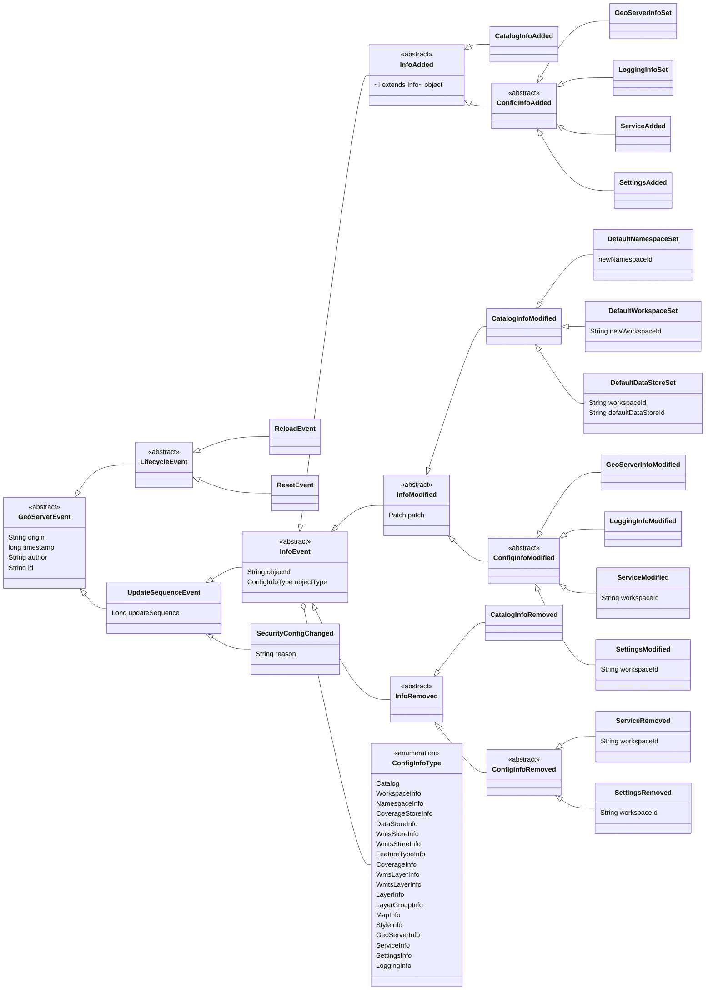

# Catalog Events Module

Implements an application-level catalog/config events object model
and standard event propagation mechanism through the ApplicationContext.

The event object hierarchy has a notion of whether the event was generated
by the running service instance or a remote one, but is not tied to any
distributed event delivery mechanism. That responsibility is left to
an integration architectural layer.

Standard Spring `@EventListeners` can hence be used to implement
orthogonal concerns. Care must be taken to filter out events
by `InfoEvent.isLocal()` and `InfoEvent.isRemote()` as appropriate,
if relevant to the listener.

A spring-boot `AutoConfiguration` is provided to enable or disable
the usage of these application-level level events, through
the `geoserver.catalog.events.enabled` boolean configuration property.

As a convenience, the `@ConditionalOnCatalogEvents` annotation
can be used to enable additional functionality on any downstream
dependency.

