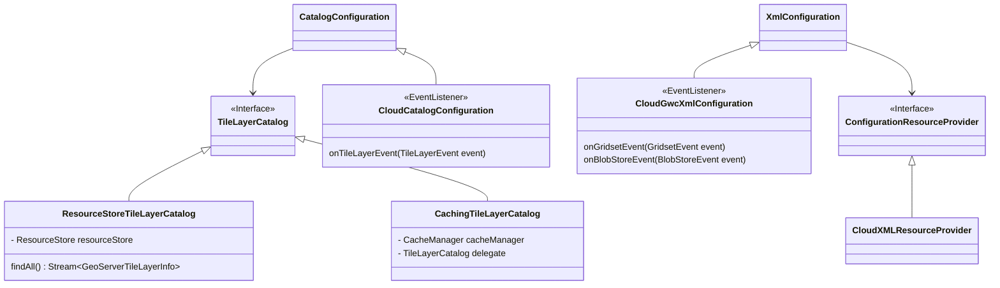

# GeoWebCache starter

A set of spring-boot auto configurations to integrate different
GeoWebcache functionalities into other microservices.

## Cloud Native GeoServer specific extensions

## Usage

